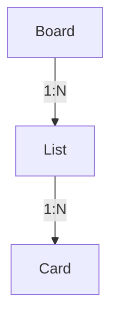
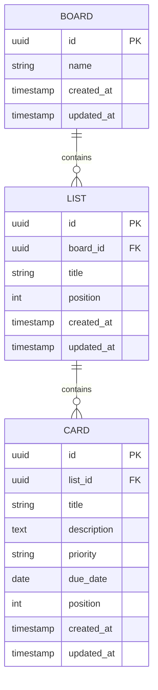

# データ構造・ER図

[要件定義書](./requirements.md) の詳細ドキュメント。Trello風タスク管理アプリのデータ構造・データベース設計をまとめる。

DBエンジンはPostgreSQL、スキーマ管理はFlywayで行う（[技術スタック](./tech-stack.md)参照）。以下のテーブル定義は実際のマイグレーション（`backend/src/main/resources/db/migration/V1__init.sql`）およびJPAエンティティ（`backend/src/main/java/.../entity/`）と一致させている。

## 概念構造（参考）

## ER図

- 今回はボードは1つのみ運用するが、将来の複数ボード対応（[要件定義書](./requirements.md) 4.2）を見据え、Boardを起点とした構造としておく
- 認証機能を持たないため、User等のエンティティは設けない

- `position` はリスト内・ボード内での並び順を保持するための整数値（ドラッグ&ドロップの並び替え結果を反映する）

## テーブル定義

### board（ボード）

| カラム名 | 型 | NULL | 制約・備考 |
|---|---|---|---|
| id | UUID | NOT NULL | PK。アプリケーション側（Hibernateの`UuidGenerator`）で採番 |
| name | VARCHAR(255) | NOT NULL | ボード名 |
| created_at | TIMESTAMP | NOT NULL | 作成日時（`@CreationTimestamp`で自動設定） |
| updated_at | TIMESTAMP | NOT NULL | 更新日時（`@UpdateTimestamp`で自動更新） |

- 現時点ではレコードは1件のみ運用する（[要件定義書](./requirements.md) 4.1）

### list（リスト）

| カラム名 | 型 | NULL | 制約・備考 |
|---|---|---|---|
| id | UUID | NOT NULL | PK |
| board_id | UUID | NOT NULL | FK → `board.id` |
| title | VARCHAR(255) | NOT NULL | リスト名 |
| position | INT | NOT NULL | ボード内での表示順（0始まり） |
| created_at | TIMESTAMP | NOT NULL | 作成日時 |
| updated_at | TIMESTAMP | NOT NULL | 更新日時 |

インデックス：`idx_list_board_id`（`board_id`。ボード配下のリスト一覧取得の高速化）

### card（カード）

| カラム名 | 型 | NULL | 制約・備考 |
|---|---|---|---|
| id | UUID | NOT NULL | PK |
| list_id | UUID | NOT NULL | FK → `list.id` |
| title | VARCHAR(255) | NOT NULL | カードタイトル（[機能要件](./features.md)：必須） |
| description | TEXT | NULL | 説明文（任意） |
| priority | VARCHAR(10) | NULL | 優先度（任意）。値は`HIGH` / `MID` / `LOW`の3種（Java側`Priority` enum、`@Enumerated(EnumType.STRING)`で文字列格納） |
| due_date | DATE | NULL | 期限（任意） |
| position | INT | NOT NULL | リスト内での表示順（0始まり） |
| created_at | TIMESTAMP | NOT NULL | 作成日時 |
| updated_at | TIMESTAMP | NOT NULL | 更新日時 |

インデックス：`idx_card_list_id`（`list_id`。リスト配下のカード一覧取得の高速化）

## 参照整合性・カスケード削除について

- `list.board_id`・`card.list_id`の外部キーは、現在のマイグレーション（V1）では`ON DELETE CASCADE`を指定していない（デフォルトの`NO ACTION`）
- [機能要件](./features.md)ではリスト削除時に内包するカードも削除する仕様のため、リスト・カードの削除API実装時には、DB制約（`ON DELETE CASCADE`への変更）またはアプリケーション層（サービスクラスでの明示的な子レコード削除）のいずれかでカスケード削除を保証する必要がある（削除API未実装のため、2026-08-22時点では未対応）

## マイグレーション管理

- Flywayでスキーマを管理し、`backend/src/main/resources/db/migration/`配下に`V<番号>__<説明>.sql`の形式で配置する
  - `V1__init.sql`：board / list / cardテーブルの初期作成
  - `V2__seed_data.sql`：ローカル動作確認用のサンプルデータ投入（ボード1件、リスト3件、カード7件）
- `bootRun`起動時にFlywayが未適用のマイグレーションを自動実行する（[技術スタック](./tech-stack.md)参照）
