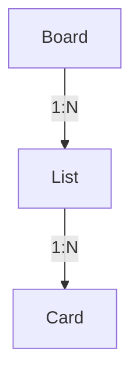
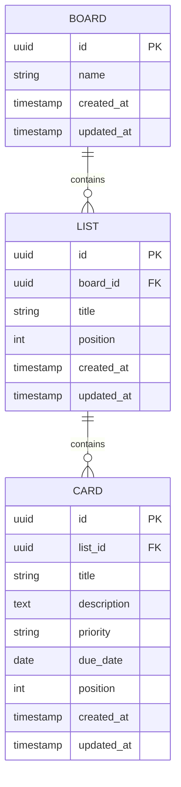

# データ構造・ER図

[要件定義書](./requirements.md) の詳細ドキュメント。Trello風タスク管理アプリのデータ構造をまとめる。

## 概念構造（参考）

## ER図

- 今回はボードは1つのみ運用するが、将来の複数ボード対応（[要件定義書](./requirements.md) 4.2）を見据え、Boardを起点とした構造としておく

- `position` はリスト内・ボード内での並び順を保持するための整数値（ドラッグ&ドロップの並び替え結果を反映する）
- 認証機能を持たないため、User等のエンティティは設けない
