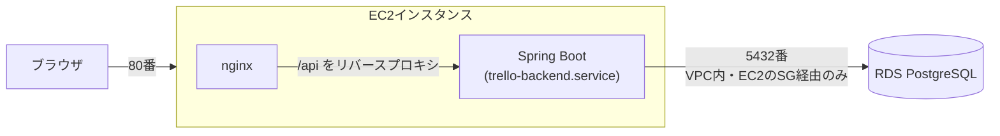

# インフラ構成：AWSデプロイ

[要件定義書](./requirements.md) の詳細ドキュメント。本アプリをAWS上にデプロイした際のインフラ構成をまとめる。

学習目的（AWS CLI・Terraformを使ったコマンドラインベースのデプロイの習得）として、[非機能要件](./non-functional-requirements.md)で定めた「ローカル環境限定」の方針を一部拡張し、AWS上に実際に公開した。構築・変更はすべてTerraform（`infra/`配下）で行っており、**構成の正確なコードはそちらを参照する**。本ドキュメントは全体構成・設計方針の把握を目的とした参考情報であり、Terraformコードそのものの転記や、個々の設定値（IPアドレス・AMI ID等、`terraform apply`のたびに変わる値）の記載は行わない。

## 全体構成

- ブラウザからのリクエストはすべて80番ポートでnginxが受ける
- nginxは静的ファイル（フロントエンドのビルド成果物）を直接配信し、`/api`配下のリクエストのみバックエンド（`127.0.0.1:8080`）へリバースプロキシする
- バックエンドはsystemdユニット（`trello-backend.service`）としてEC2上で常駐する
- RDSはインターネットから直接アクセスできず、EC2のセキュリティグループ経由のみ接続を許可する

## 構成要素

| 要素 | 方針 |
|---|---|
| リージョン | 東京（ap-northeast-1） |
| コンピュート | EC2（Amazon Linux 2023）1台。無料利用枠対象のインスタンスタイプを使用し、Elastic IPは使わない（パブリックIPは自動割り当てのもの） |
| データベース | RDS（PostgreSQL、シングルAZ）。無料利用枠対象のインスタンスクラスを使用し、`publicly_accessible = false`でインターネットに公開しない |
| Webサーバー | nginx（静的ファイル配信 + `/api`のリバースプロキシ）。Dockerは使わずEC2上へ直接インストールする |
| バックエンド実行環境 | Java（EC2上へ直接インストール）。低メモリ環境向けにJVMヒープ上限等を明示指定している |
| ネットワーク | デフォルトVPCを利用。EC2は自分のPCからのSSH・HTTPのみ許可、RDSはEC2のセキュリティグループからのみ許可（送信元IPではなくセキュリティグループ単位で制御） |
| IAM | Terraform実行用のIAMユーザーに、用途ごとに絞った権限のポリシーを個別付与（EC2用・RDS用・MFA自己管理用）。1つのポリシーに全権限をまとめない方針 |
| コスト方針 | AWS無料利用枠（Free Tier）を最優先。NAT Gateway・ALB・ECS Fargate・RDSマルチAZ等、無料枠が薄い/対象外のサービスは使用しない |

## デプロイ・運用の考え方

- インフラのコード（Terraform）は`infra/`配下で管理する。ディレクトリ構成は[README](../README.md)を参照
- アプリのビルド・デプロイは、EC2側の低メモリ制約を考慮し「ローカル環境でビルドし、成果物のみをEC2へ配置する」方式を採用している（EC2上ではビルドを行わない）
- インフラは`terraform apply`／`terraform destroy`で作成・削除する。学習目的の環境であり常時稼働を前提としないため、使わない時間帯はリソースを削除し、課金を発生させない運用としている
- 段階的に構築した（EC2単体 → RDS追加 → アプリのデプロイ、の順）。一度に全リソースを作らず、各段階で動作確認しながら進めた

## 今後の課題（未対応）

- HTTPS化（現状はHTTPのみ）
- MFAの実際のデバイス登録（IAMユーザーへの権限付与のみ完了、デバイスの有効化は未実施）
- Terraform stateのリモートバックエンド化（現状はローカル保存）
