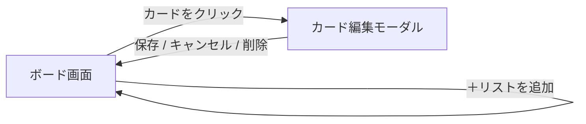
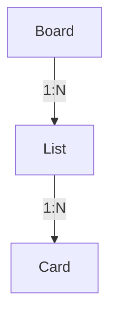
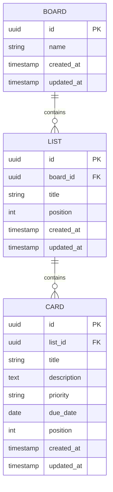

# 要件定義書：Trello風タスク管理アプリ

## 1. 概要

個人利用を目的とした、Trello風のシンプルなタスク管理Webアプリケーション。
スクール課題として開発する。

## 2. 背景・目的

- 本プロジェクトはスクールの課題として取り組むものであり、特定の業務課題やビジネス上の目的があるわけではない
- 主目的は学習：要件定義〜設計〜実装という開発の一連の流れを一人で経験し、身につけること
- 副次的な狙いとして、実際に自分の日々のタスク管理に使えるものを作ることで、成果物としての実用性・学習の定着度を高める

## 3. 想定利用者

- 開発者本人のみ（1ユーザー）
- ログイン・認証機能は不要

## 4. スコープ

### 4.1 今回実装する範囲（MVP）

- ボード・リスト・カードによるタスク管理
- カードのドラッグ&ドロップ（リスト間移動、リスト内並び替え）
- バックエンドAPI・データベースによるデータ永続化（ブラウザを閉じてもデータが残る）

### 4.2 将来的に追加したい範囲（今回は対象外）

- ラベル・タグ
- コメント機能
- 検索・フィルタ
- 複数ボードの切り替え
- ログイン・複数ユーザー対応

### 4.3 明確に対象外とするもの

- 担当者（アサイン）機能
- 他ユーザーとのデータ共有・同期

## 5. 機能要件

### 5.1 ボード

- ボードは1つのみ（複数ボード管理は将来対応）

### 5.2 リスト

| 機能 | 内容 |
|---|---|
| 作成 | 新しいリストを追加できる |
| 名前変更 | リスト名を編集できる |
| 削除 | リストを削除できる（内包するカードも削除） |
| 並び替え | 将来対応（今回のスコープ外） |

初期リスト例：「未着手」「進行中」「完了」（変更・追加可能とする）

### 5.3 カード

| 項目 | 必須 | 備考 |
|---|---|---|
| タイトル | 必須 | 1行テキスト |
| 説明文 | 任意 | 複数行テキスト |
| 優先度 | 任意 | 例：高・中・低 |
| 期限 | 任意 | 日付 |

操作：

- 作成・編集・削除ができる
- リスト間をドラッグ&ドロップで移動できる
- 同一リスト内でドラッグ&ドロップにより並び替えができる

### 5.4 データ永続化

- カード・リスト・ボードの情報はバックエンドAPIを介してデータベースに保存する
- ブラウザを閉じても、再度開いた際にデータが保持されていること
- 対象は開発者本人の環境のみを想定（複数端末での同期は不要）

## 6. 画面仕様

### 6.1 画面構成

- 単一ページ構成（SPA）とし、画面遷移は行わず、すべての操作を1画面内で完結させる

### 6.2 ボード画面（メイン画面）

- 画面上部にヘッダー（アプリ名）を表示
- ヘッダー下に、リストを横方向に並べて表示する
- 各リストは列（カラム）状に表示し、以下を含む
  - リスト名
  - カード一覧（縦に並べる）
  - 「＋カードを追加」ボタン（リスト下部）
- リスト群の末尾に「＋リストを追加」ボタンを配置する

### 6.3 リスト操作のUI

- リスト名はクリックで直接編集できるインライン編集とする（別画面・モーダルは設けない）
- リスト削除は、リストヘッダーのメニュー（「…」等）から選択する
  - 内包するカードも一緒に削除されるため、確認ダイアログを挟んでから削除する

### 6.4 カードの表示

- カードには最低限タイトルを表示する
- 優先度が設定されている場合、色付きラベルで表示する
  - 高：赤／中：黄／低：青（グレー系でも可）
- 期限が設定されている場合、日付を表示する
  - 期限超過時の強調表示（赤字にする等）は行ってもよいが、今回は必須要件としない

### 6.5 カード作成・編集

- リスト下部の「＋カードを追加」から、まずタイトルのみを簡易入力してカードを作成する
- 作成済みのカードをクリックすると編集用モーダルが開き、タイトル・説明文・優先度・期限を編集できる
- 入力内容は保存操作（ボタン押下）で確定する

### 6.6 カード削除

- カード編集モーダル内に削除ボタンを配置する
- 確認ダイアログを経由してから削除する

## 7. 画面遷移

- 本アプリは画面数が少なく（ボード画面＋カード編集モーダルのみ）、ページ遷移は発生しない
- カード編集はモーダル表示、リスト名編集・カード追加はインライン入力とし、いずれもボード画面上に留まる

## 8. ユースケース／操作フロー

| ID | ユースケース | 操作フロー | 結果 |
|---|---|---|---|
| UC-01 | リストを作成する | 「＋リストを追加」をクリック→リスト名を入力→確定 | 新しいリストがボード末尾に追加される |
| UC-02 | リスト名を変更する | リスト名をクリック→編集状態になる→入力し直す→確定 | リスト名が更新される |
| UC-03 | リストを削除する | リストメニューから「削除」を選択→確認ダイアログで実行 | リストと内包する全カードが削除される |
| UC-04 | カードを作成する | 「＋カードを追加」をクリック→タイトルを入力→確定 | カードがリスト末尾に追加される（説明文・優先度・期限は未設定） |
| UC-05 | カードを編集する | カードをクリック→編集モーダルが開く→各項目を編集→保存 | カード内容が更新される |
| UC-06 | カードを削除する | カード編集モーダルの削除ボタン→確認ダイアログで実行 | カードが削除される |
| UC-07 | カードをリスト間で移動する | カードをドラッグし、別のリストにドロップ | カードが移動先リストに移動し、位置はドロップ位置に応じる |
| UC-08 | カードを同一リスト内で並び替える | カードをドラッグし、同一リスト内の別の位置にドロップ | カードの並び順が更新される |
| UC-09 | 再訪問時にデータを確認する | ブラウザでアプリを開き直す | 前回終了時のボード状態がそのまま表示される（DBから再取得） |

## 9. 非機能要件

### 9.1 性能

- カード数が数十〜100枚程度までは、操作（表示・ドラッグ&ドロップ）に対して体感的な遅延がないこと（目安：操作から画面反映まで200ms以内）
- 数百枚規模の大量データでの性能保証は対象外とする（個人利用の想定範囲を超えるため）

### 9.2 可用性

- バックエンド・DBを含め、開発者本人のローカル環境で起動・動作させることを想定する（インターネットへの公開は行わない）
- 稼働率・障害復旧などのSLAは定義しない（個人利用のため対象外）

### 9.3 セキュリティ

- ログイン機能を持たないため、認可・権限管理は対象外とする
- バックエンドAPIはローカル環境でのみ動作させ、外部（インターネット）に公開しないことを前提とする。将来的に外部公開する場合は、認証機構の追加を別途検討する
- DBへのアクセスはORM等のパラメータ化されたクエリ経由で行い、SQLインジェクションを防止する（実装方法は技術選定フェーズで決定）
- ユーザー入力をDOMに描画する箇所ではXSS対策（エスケープ処理）を行う

### 9.4 保守性・拡張性

- 将来的な機能追加（ラベル、複数ボード等）を見据え、フロントエンド・バックエンドともにコンポーネント／レイヤー単位で責務を分離した設計とする
- TypeScriptの型定義により、データ構造の一貫性を保つ

### 9.5 ユーザビリティ

- 主要な操作（作成・編集・削除）は3クリック以内で完了できることを目安とする
- 破壊的な操作（リスト削除・カード削除）には確認ダイアログを設ける

### 9.6 互換性

- フロントエンドはGoogle Chromeの最新版で動作することを必須とする
- バックエンド・DBは開発者本人のローカル環境（Mac）で動作すればよく、具体的なランタイム・DBエンジンのバージョンは技術選定フェーズで決定する
- PCでの利用を前提とし（目安：画面幅1280px以上）、スマートフォン・タブレット向けレイアウトには対応しない

### 9.7 データ永続性・信頼性

- データベースにより永続化し、ブラウザやアプリを閉じてもデータが失われないこと
- バックアップ・エクスポート機能は今回のスコープ外とする
- DBのスキーマ変更（マイグレーション）の管理方法は技術選定フェーズで決定する

## 10. データ構造・ER図

### 10.1 概念構造（参考）

### 10.2 ER図

- 今回はボードは1つのみ運用するが、将来の複数ボード対応（4.2）を見据え、Boardを起点とした構造としておく

- `position` はリスト内・ボード内での並び順を保持するための整数値（ドラッグ&ドロップの並び替え結果を反映する）
- 認証機能を持たないため、User等のエンティティは設けない

## 11. 技術スタック

- フロントエンド：React + TypeScript + Vite
- 状態管理：React標準の useState / useContext 等で対応する（本アプリの規模では外部状態管理ライブラリは不要と判断）
- データ永続化：バックエンドAPI経由でデータベースに保存する（DBエンジン・ORMは未定、10章のER図をもとに次の技術選定フェーズで決定）
- バックエンド：フレームワーク・API設計は未定（次の技術選定フェーズで決定）
- ドラッグ&ドロップ：dnd-kit（@dnd-kit/core）を採用
  - 理由：旧来よく使われた react-beautiful-dnd はメンテナンス終了しているため非推奨。dnd-kitは軽量かつ活発にメンテナンスされており、最新のReactにも対応している
- スタイリング：CSS Modules など、追加ライブラリに依存しないシンプルな手段を想定（詳細は設計フェーズで決定）
- ビルド・開発環境（フロントエンド）：Vite

## 12. 未決定事項

- バックエンドのフレームワーク（例：Express、Fastify等）
- DBエンジン（例：PostgreSQL、MySQL、SQLite等）
- ORM／DBアクセス方法、マイグレーション管理の方法
- フロントエンド〜バックエンド間のAPI仕様（エンドポイント設計等）
- フロントエンドのデータ取得方法（fetch直書き／React Query等のライブラリ利用の要否）

上記は7章（画面遷移）・10章（ER図）を踏まえ、次の技術選定フェーズで決定する。
