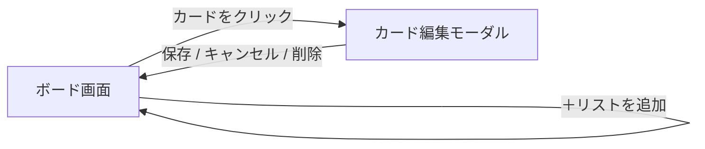

# 画面仕様・画面遷移・ユースケース

[要件定義書](./requirements.md) の詳細ドキュメント。Trello風タスク管理アプリの画面設計をまとめる。

## 画面仕様

### 画面構成

- 単一ページ構成（SPA）とし、画面遷移は行わず、すべての操作を1画面内で完結させる

### ボード画面（メイン画面）

- 画面上部にヘッダー（アプリ名）を表示
- ヘッダー下に、リストを横方向に並べて表示する
- 各リストは列（カラム）状に表示し、以下を含む
  - リスト名
  - カード一覧（縦に並べる）
  - 「＋カードを追加」ボタン（リスト下部）
- リスト群の末尾に「＋リストを追加」ボタンを配置する

### リスト操作のUI

- リスト名はクリックで直接編集できるインライン編集とする（別画面・モーダルは設けない）
- リスト削除は、リストヘッダーのメニュー（「…」等）から選択する
  - 内包するカードも一緒に削除されるため、確認ダイアログを挟んでから削除する

### カードの表示

- カードには最低限タイトルを表示する
- 優先度が設定されている場合、色付きラベルで表示する
  - 高：赤／中：黄／低：青（グレー系でも可）
- 期限が設定されている場合、日付を表示する
  - 期限超過時の強調表示（赤字にする等）は行ってもよいが、今回は必須要件としない

### カード作成・編集

- リスト下部の「＋カードを追加」から、まずタイトルのみを簡易入力してカードを作成する
- 作成済みのカードをクリックすると編集用モーダルが開き、タイトル・説明文・優先度・期限を編集できる
- 入力内容は保存操作（ボタン押下）で確定する

### カード削除

- カード編集モーダル内に削除ボタンを配置する
- 確認ダイアログを経由してから削除する

## 画面遷移

- 本アプリは画面数が少なく（ボード画面＋カード編集モーダルのみ）、ページ遷移は発生しない
- カード編集はモーダル表示、リスト名編集・カード追加はインライン入力とし、いずれもボード画面上に留まる

## ユースケース／操作フロー

| ID | ユースケース | 操作フロー | 結果 |
|---|---|---|---|
| UC-01 | リストを作成する | 「＋リストを追加」をクリック→リスト名を入力→確定 | 新しいリストがボード末尾に追加される |
| UC-02 | リスト名を変更する | リスト名をクリック→編集状態になる→入力し直す→確定 | リスト名が更新される |
| UC-03 | リストを削除する | リストメニューから「削除」を選択→確認ダイアログで実行 | リストと内包する全カードが削除される |
| UC-04 | カードを作成する | 「＋カードを追加」をクリック→タイトルを入力→確定 | カードがリスト末尾に追加される（説明文・優先度・期限は未設定） |
| UC-05 | カードを編集する | カードをクリック→編集モーダルが開く→各項目を編集→保存 | カード内容が更新される |
| UC-06 | カードを削除する | カード編集モーダルの削除ボタン→確認ダイアログで実行 | カードが削除される |
| UC-07 | カードをリスト間で移動する | カードをドラッグし、別のリストにドロップ | カードが移動先リストに移動し、位置はドロップ位置に応じる |
| UC-08 | カードを同一リスト内で並び替える | カードをドラッグし、同一リスト内の別の位置にドロップ | カードの並び順が更新される |
| UC-09 | 再訪問時にデータを確認する | ブラウザでアプリを開き直す | 前回終了時のボード状態がそのまま表示される（DBから再取得） |
