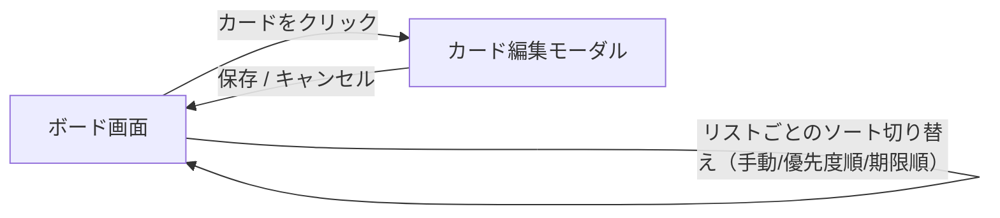

# 画面仕様・画面遷移・ユースケース

[要件定義書](./requirements.md) の詳細ドキュメント。Trello風タスク管理アプリの画面設計をまとめる。

## 画面仕様

### 画面構成

- 単一ページ構成（SPA）とし、画面遷移は行わず、すべての操作を1画面内で完結させる

### ボード画面（メイン画面）

- 画面上部にヘッダー（アプリ名）を表示
- ヘッダー下に、リストを横方向に並べて表示する
- 各リストは列（カラム）状に表示し、以下を含む
  - リスト名
  - カード一覧（縦に並べる）
  - 「＋カードを追加」ボタン（リスト下部）
- リスト群の末尾に「＋リストを追加」ボタンを配置する（未実装。現時点ではDBの初期データによる固定リストのみ）

### リスト操作のUI（未実装）

以下はリスト自体の作成・編集・削除に関する設計方針だが、現時点ではいずれも未実装（リストは読み取り専用で、DBの初期データによる固定リストのみを表示する）。

- リスト名はクリックで直接編集できるインライン編集とする（別画面・モーダルは設けない）
- リスト削除は、リストヘッダーのメニュー（「…」等）から選択する
  - 内包するカードも一緒に削除されるため、確認ダイアログを挟んでから削除する

各リストのヘッダーには、カードの表示順を「手動／優先度順／期限順」から切り替えるソート選択（実装済み）を配置する。

### カードの表示

- カードには最低限タイトルを表示する
- 優先度が設定されている場合、色付きラベルで表示する
  - 高：赤／中：黄／低：青（グレー系でも可）
- 期限が設定されている場合、日付を表示する
  - 期限超過時の強調表示（赤字にする等）は行ってもよいが、今回は必須要件としない

### カード作成・編集

- リスト下部の「＋カードを追加」から、タイトル・説明文・優先度・期限・ステータス（所属リスト）をまとめて入力してカードを作成する（タイトルのみ必須、他は任意。ステータスの初期値はクリックしたリストだが変更可能）
- 作成済みのカードをクリックすると編集用モーダルが開き、タイトル・説明文・優先度・期限・ステータス（所属リスト）を編集できる
- 入力内容は保存操作（ボタン押下）で確定する。ステータスを変更した場合は、保存時に対象リストの末尾へ移動する

### カード削除

- カードにマウスホバーすると右上に削除ボタン（×）が表示される
- 削除ボタン押下時、確認ダイアログ（`window.confirm`）を経由してから削除する
- 削除は物理削除（DBから完全に削除）とする

## 画面遷移

- 本アプリは画面数が少なく（ボード画面＋カード編集モーダルのみ）、ページ遷移は発生しない
- カード編集はモーダル表示、カード追加はインライン入力とし、いずれもボード画面上に留まる（リスト名のインライン編集は未実装）

「＋リストを追加」・リスト名インライン編集・リスト削除メニューは未実装のため、上図には含めていない。

## ユースケース／操作フロー

| ID | ユースケース | 操作フロー | 結果 |
|---|---|---|---|
| UC-01 | リストを作成する（未実装） | 「＋リストを追加」をクリック→リスト名を入力→確定 | 新しいリストがボード末尾に追加される |
| UC-02 | リスト名を変更する（未実装） | リスト名をクリック→編集状態になる→入力し直す→確定 | リスト名が更新される |
| UC-03 | リストを削除する（未実装） | リストメニューから「削除」を選択→確認ダイアログで実行 | リストと内包する全カードが削除される |
| UC-04 | カードを作成する | 「＋カードを追加」をクリック→タイトル（必須）・説明文・優先度・期限・ステータスを入力→確定 | カードが対象リストの末尾に追加される |
| UC-05 | カードを編集する | カードをクリック→編集モーダルが開く→各項目（タイトル・説明文・優先度・期限・ステータス）を編集→保存 | カード内容が更新される。ステータスを変更した場合は対象リストの末尾へ移動する |
| UC-06 | カードを削除する | カードにマウスホバー→表示された削除ボタン（×）をクリック→確認ダイアログで実行 | カードが物理削除される |
| UC-07 | カードをリスト間で移動する | カードをドラッグし、別のリストにドロップ（またはカード編集モーダルでステータスを変更） | カードが移動先リストに移動し、位置はドロップ位置（またはリスト末尾）に応じる |
| UC-08 | カードを同一リスト内で並び替える | カードをドラッグし、同一リスト内の別の位置にドロップ | カードの並び順が更新される |
| UC-08a | リスト内のカード表示順を切り替える | リストヘッダーのソート選択で「優先度順」または「期限順」を選ぶ | カードがその基準で並び替わって表示される（DB上の手動順はソート表示だけでは変更されない） |
| UC-09 | 再訪問時にデータを確認する | ブラウザでアプリを開き直す | 前回終了時のボード状態がそのまま表示される（DBから再取得） |
